## 1. RIM AI Expressive Portraits

---

- **RIM AI Expressive Portraits**는 정착민의 **게임 내 모습(스프라이트), 건강 상태, 나이, 성별 등의 정보**를 바탕으로 AI 초상화를 생성해주는 모드입니다.

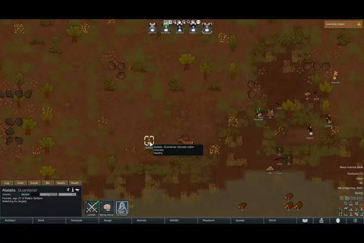

- 정착민의 **게임 내 모습, 건강 상태, 나이, 성별 등의 정보**를 조합해 Gemini, OpenAI 또는 ComfyUI로 초상화를 생성합니다.

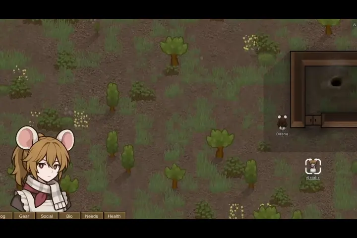

-  또한 정착민의 상태에 따라 **다른 모습을 표시 가능합니다.**

## 2. 요구 사항

---

- RimWorld 1.5 or 1.6

- [Harmony](https://steamcommunity.com/sharedfiles/filedetails/?id=2009463077)

- 이미지 생성이 가능한 Provider:
  
  - OpenAI API key
  - Google AI API key
  - local ComfyUI server

## 3. 기능

---

### 3-1. 기본 초상화 생성

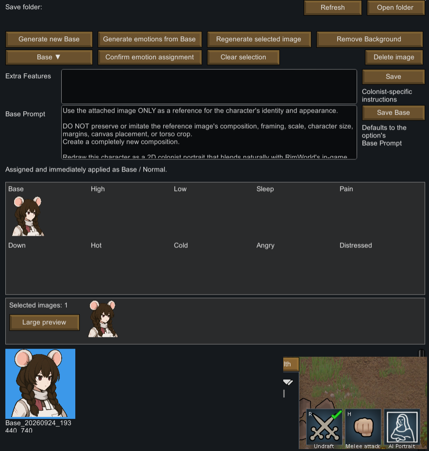

- 정착민의 행동 목록에 AI 초상화 메뉴를 여는 버튼이 있습니다.

- 정착민이 처음 접근되는 순간에 기본 프롬프트가 옵션에서 가져와집니다. 각 정착민별로 기본 프롬프트를 수정하거나, 추가로 공급하고 싶은 정보를 Extra에 넣을 수 있습니다.

- 생성 방법은 다음과 같습니다.
  
  - Generate new Base 버튼을 누릅니다.
  
  - 기다립니다. 
  
  - 생성된 초상화를 클릭하고 Confirm emotion assignment를 누릅니다.
- 그 외 지원 기능은 다음과 같습니다.
  - 선택한 이미지 재생성
  - 배경색 삭제
  - 이미지 삭제
  - 이미지 폴더 열기

### 3-2. 감정 초상화 생성

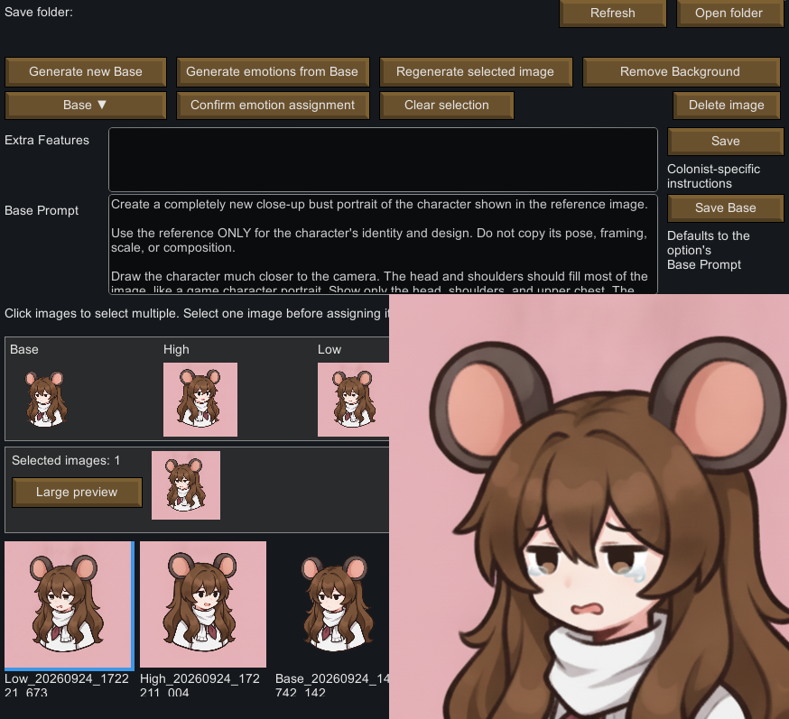

- 생성된 감정으로 부터 여러 파생된 감정 상태 초상화를 생성 가능합니다.

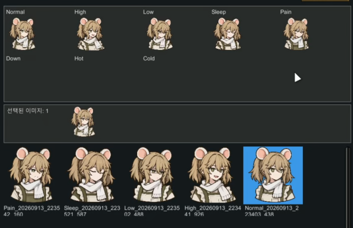

- 여러 감정 표현이 있지만, 옵션에서 체크해야 보입니다. 기본으로 Low(무드 낮음)과 High(무드 높음)만 켜져있습니다.

- 생성 방법은 다음과 같습니다.
  
  - Base 이미지를 선택합니다.
  
  - Generation emotions from Base를 누릅니다.
  
  - 생성할 감정만 체크하고 생성합니다.

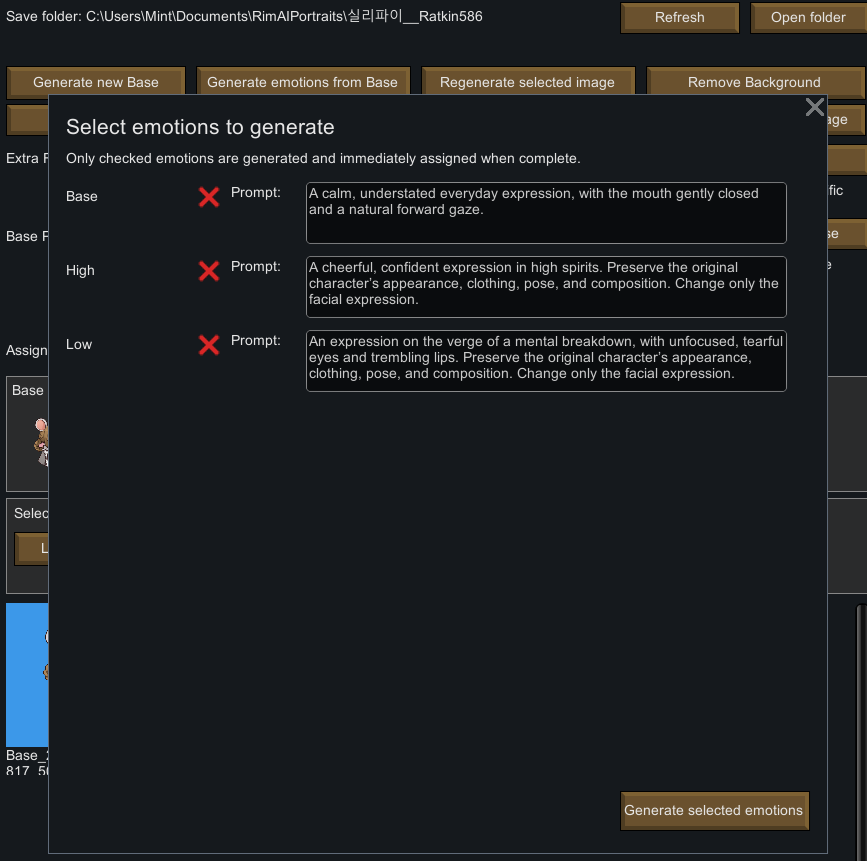

### 3-3. 배경 제거

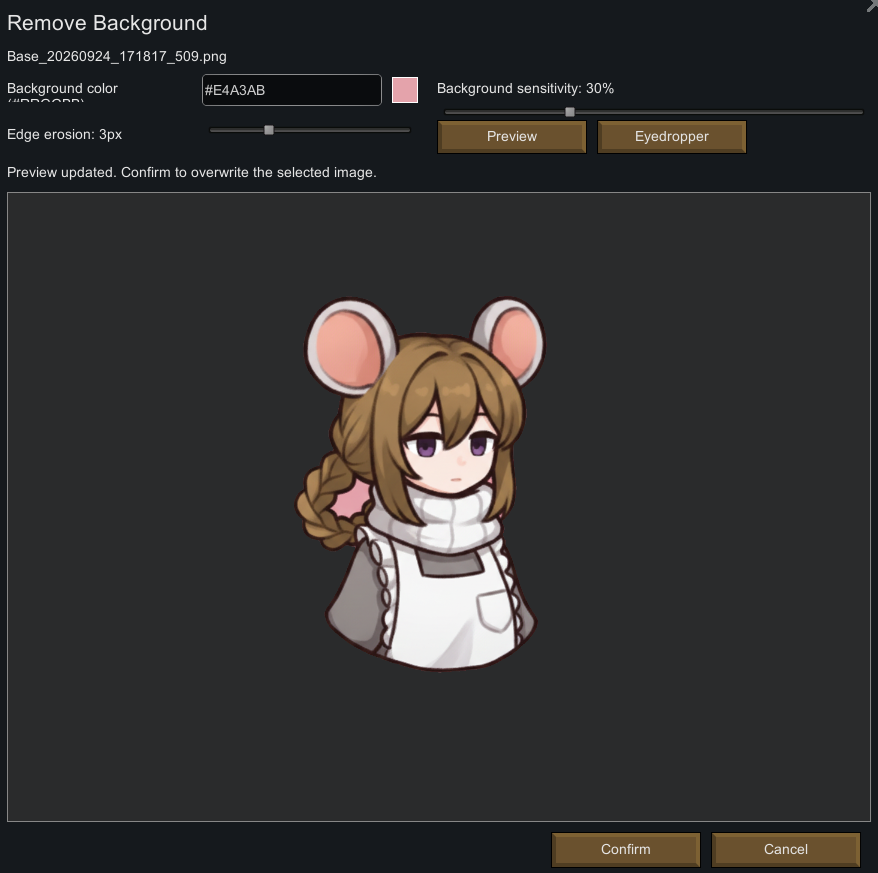

- OpenAI의 경우 배경을 자동으로 투명으로 지정해서 보낼 수 있지만, 어떤 Provider는 그게 안되기도 합니다. 배경 제거 옵션에서 스포이드로 배경색을 고르고 날려버릴 수 있습니다. 

- Align 버튼을 누르면 아래 면을 기준으로 이미지가 정렬됩니다.

### 3-4. OpenAI

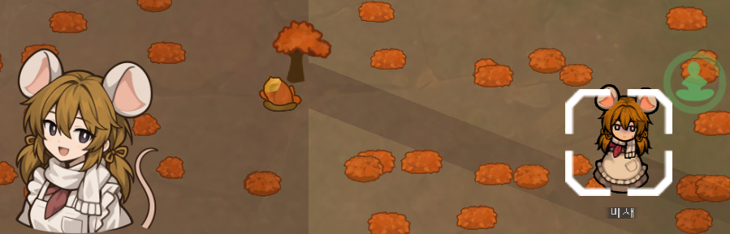

- openai의 sunburst의 low quality가 가장 많이 테스트한 모델입니다. 투명 배경을 지원하며 여러 모델을 테스트 했을 때 퀄리티 대비 저렴한 편입니다. medium/high는 가격이 꽤 됩니다.

- 제작자가 개인 테스트를 했을 때, open-ai-sunburst low quality 기준 5장을 생성 할 때 0.08$가 나왔습니다. 

- 그래도 장 당 요금이 얼마 나오는지는 확실하게 모르니 key 별 요금을 잘 보고 있길 바랍니다.

### 3-5. Google Gemini

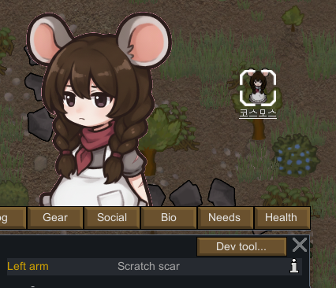

- 투명 배경을 지원하지 않습니다. 투명 배경을 일관성 있게 뽑기가 어려웠기에 OpenAI과 경쟁하다가 테스트 단계에서 기본 옵션에서 밀려났습니다.

- 퀄리티는 낮은 편은 아니지만 현재 프롬프트에서 조금씩 튀는 경향이 있습니다. 

### 3-6. Comfy(Local Model)

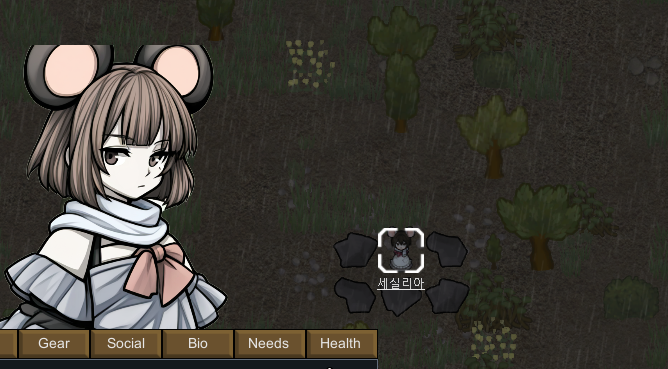

- 로컬 모델 셋업은 정말 많은 시간과 노력을 투자해야합니다. 특히 일관성을 유지하려면요. 물론 저는 원하는 결과를 뽑아내는 것에 실패했습니다. 

- 테스트에 사용한 파이프라인을 공개할 예정입니다.

## 4. 옵션

---

### 4-1. 기본 옵션

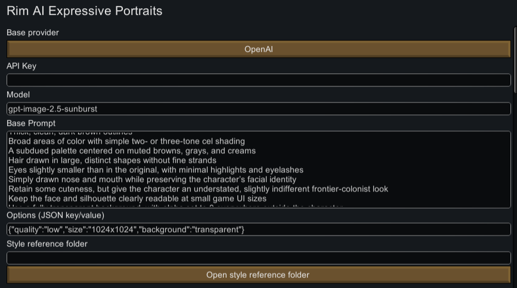

- Provider는 OpenAI/Gemini/Comfy(Local Model) 중에 고를 수 있습니다.

- 기본으로 OpenAI와 gpt-image-2.5-sunburst 으로 설정되어있으며, API Key를 넣으면 됩니다.

- **WIP**: Style Reference는 참조할 여러 이미지를 추가하는 기능인데 활용이 어려워서 구상중입니다. 아마 프롬프트도 이미지 여러 장 들어가는거에 맞춰서 바꿔야 할 거에요.

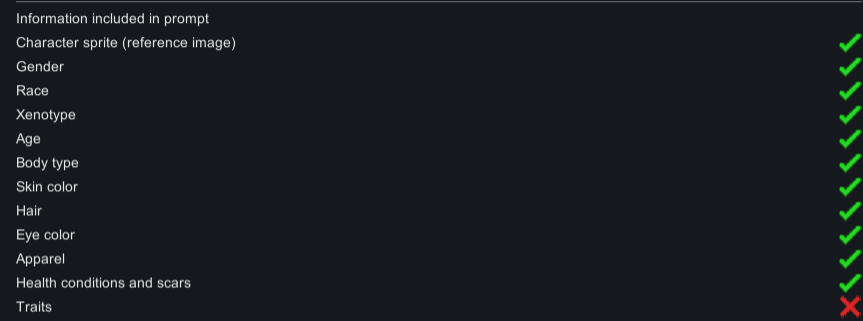

- 어떤 정보가 프롬프트에 자동으로 반영될지 고를 수 있습니다. 기본적으로 캐릭터의 인게임 이미지와 텍스트 정보(성별, 나이) 등을 동시에 반영해서 이미지를 생성합니다.

### 4-2. 감정 옵션

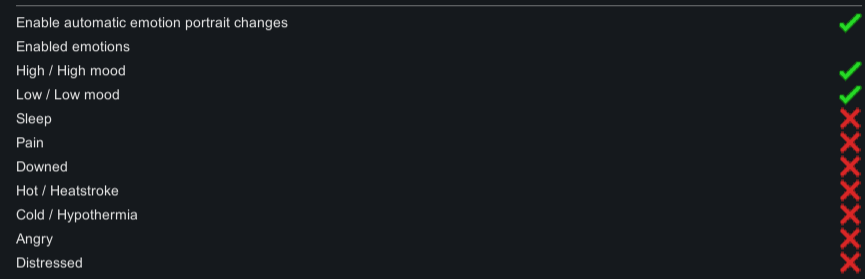

- 정착민의 상태에 따라 초상화를 교체하게 할 수 있습니다. 총 9가지가 있는데, 다켜면 꽤 돈이 많이 나갈거에요. 이 기능은 끄고 사용해도 무방합니다.

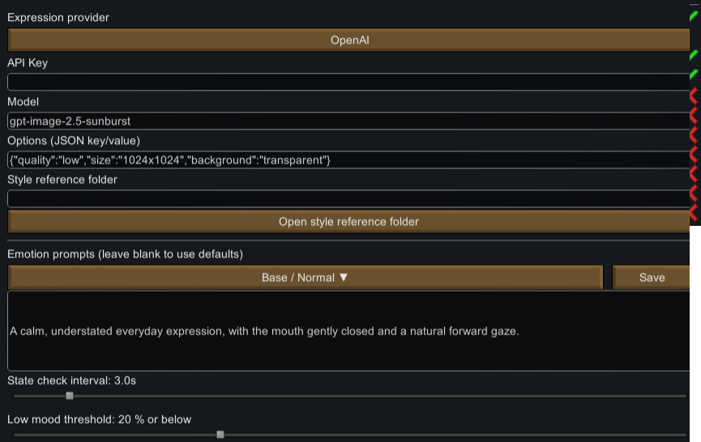

- 감정 표현 생성도 마찬가지로 Provider를 따로 공급 가능합니다. 둘 다 같은 Provider를 쓸 수도 있고, 서로 섞어 쓸 수도 있습니다.

### 4-3. 그 외 옵션

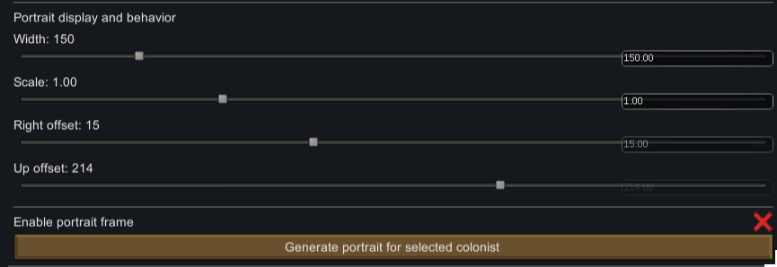

- 초상화 크기와 위치를 조절 가능합니다.

## 4. 설치 방법

---

- 준비 중

## 5. Comfy 설정 팁

---

- **로컬 모델은 설정부터 꽤 많은 시간과 노력이 필요합니다.** 여기에 감정별 초상화의 일관성까지 유지하려면 난이도가 더욱 높아지기 때문에, 관련 분야에 익숙하지 않다면 로컬 모델 사용은 권장하지 않습니다. 

- 그래도 참고할 수는 있도록, 제가 소스 코드를 테스트 할 때 사용한 파이프라인을 공개할 예정입니다.

- 준비 중

## 6. 다른 Provider 지원에 대해서

---

- **다른 Provider에 대한 공식 지원은 현재 계획하고 있지 않습니다.** Provider를 하나 추가할 때마다 제작자가 해당 서비스에 직접 가입하고, 사용 방법과 API를 익힌 뒤 테스트를 위한 비용까지 충전해야 하기 때문에 지속적으로 지원하기가 어렵습니다.

- 대신 **소스 코드를 MIT 라이선스로 공개**하고 있습니다. 출처와 라이선스 고지만 유지해 주신다면 소스 코드를 자유롭게 수정·빌드하여 **Steam 창작마당에 배포하셔도 됩니다.** 

- 또한 다른 Provider를 추가할 수 있도록 확장을 고려해 프로젝트 구조를 설계했습니다. 제 기준에서는요.

---

## 7. 소스 코드 빌드

- 준비 중
