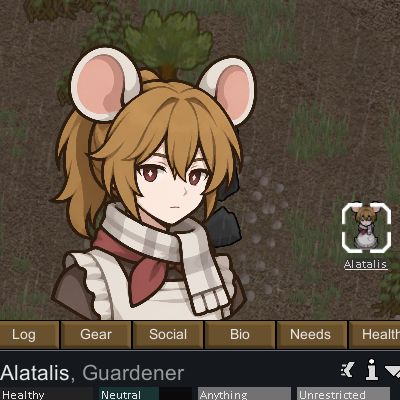

# Rim AI Expressive Portraits

Rim AI Expressive Portraits generates custom portraits for RimWorld colonists and displays them directly in the inspect pane. Portraits can react to a pawn's mood and condition, while a built-in gallery lets you generate, preview, assign, and manage images without leaving the game.



## Features

- Generate portraits with **OpenAI**, **Google Gemini**, or a local **ComfyUI** server.
- Configure separate providers and models for base portraits and expression portraits.
- Automatically switch portraits for high mood, low mood, sleep, pain, downed, heatstroke, hypothermia, angry mental states, and other mental distress.
- Choose which pawn details are included in generation prompts, including appearance, apparel, health conditions, and traits.
- Customize global prompts, per-emotion prompts, and colonist-specific instructions.
- Use the in-game gallery to preview, assign, regenerate, import, or delete portraits.
- Remove solid-color backgrounds with a preview, color picker, sensitivity control, and edge erosion.
- Adjust portrait size and position, and optionally draw a custom frame over portraits.
- English and Korean localization included.

## Requirements

- RimWorld 1.5 or 1.6
- [Harmony](https://steamcommunity.com/sharedfiles/filedetails/?id=2009463077)
- One image-generation backend:
  - an OpenAI API key,
  - a Google AI API key, or
  - a running local ComfyUI server with an API-format workflow

API providers may charge for image generation. Review the provider's current pricing and usage limits before generating portraits.

## Installation

1. Install and enable Harmony.
2. Download a packaged release, or build the mod from source as described below.
3. Copy the `RimAIPortrait` folder into your RimWorld `Mods` directory.
4. Enable **Rim AI Expressive Portraits** in RimWorld's mod manager and place it after Harmony.

A valid installed package has this layout:

```text
RimAIPortrait/
├── About/
├── Assemblies/
├── Languages/
├── Prompts/
└── Textures/
```

## Quick Start

1. Open **Options → Mod Settings → Rim AI Expressive Portraits**.
2. Select a provider for base portraits and expression portraits.
3. Enter the required API key and model, or configure your ComfyUI server and workflow.
4. Select a colonist, then click the **AI Portrait** gizmo to open the portrait gallery.
5. Generate a base portrait. Once a base portrait exists, generate the expression portraits you want.

The active portrait appears in the colonist inspect pane. Existing expression portraits switch automatically as the colonist's state changes. Animals use base portraits only.

## Provider Setup

### OpenAI

Enter an OpenAI API key and an image model in the mod settings. The options field accepts a JSON object containing request parameters such as image size, quality, and background handling.

### Google Gemini

Enter a Google AI API key and an image-capable Gemini model. Provider options are also configured as JSON; the default configuration requests a square 1K image.

### ComfyUI

Start ComfyUI, set its server URL in the mod settings (the default is `http://127.0.0.1:8188`), and export your workflow in **API format**. Set the final `SaveImage` node's `filename_prefix` to `RimAI` so the mod can identify the generated output.

The workflow JSON may contain these replacement tokens:

| Token | Replaced with |
| --- | --- |
| `__RIM_PROMPT__` | The generated positive prompt |
| `__RIM_NEGATIVE_PROMPT__` | The configured negative prompt |
| `__RIM_INPUT_IMAGE__` | The primary uploaded reference image |
| `__RIM_REFERENCE_1__` … `__RIM_REFERENCE_8__` | Uploaded reference images |
| `__RIM_SEED__` | A random seed |

You can use different URLs, workflows, negative prompts, and style-reference folders for base and expression generation.

## Portrait States

The mod supports the following states:

| State | Trigger |
| --- | --- |
| Base / Normal | Default state |
| High | Mood at or above the configured high threshold |
| Low | Mood at or below the configured low threshold |
| Sleep | Pawn is asleep |
| Pain | Pain exceeds the built-in threshold |
| Downed | Pawn is downed |
| Hot | Pawn has heatstroke |
| Cold | Pawn has hypothermia |
| Angry | Pawn is in an aggressive mental state |
| Distressed | Pawn is in another mental state |

Each state can be enabled or disabled independently. If an assigned state portrait is unavailable, the base portrait is used as the fallback.

## Using Existing Images

Open a colonist's portrait gallery and click **Open folder** to access that colonist's image directory. Add PNG or JPG files there, return to the gallery, and click **Refresh**. Select exactly one image to assign it as the base portrait or to an enabled emotional state.

The gallery also keeps generated alternatives, supports a large preview, and can remove a selected image's background before assignment.

## Building from Source

The project targets .NET Framework 4.7.2 and C# 7.3. Install a compatible .NET SDK, then run the PowerShell build script with paths to RimWorld and Harmony:

```powershell
.\Scripts\build.ps1 `
  -RimWorldDir "C:\Program Files (x86)\Steam\steamapps\common\RimWorld" `
  -HarmonyDll "C:\Program Files (x86)\Steam\steamapps\workshop\content\294100\2009463077\Current\Assemblies\0Harmony.dll"
```

For a development build, add `-Configuration Debug`. The packaged mod is written to `dist/RimAIPortrait/`.

## Development Notes

- Runtime code is in `Source/RimAIPortrait/`.
- Mod metadata, prompts, translations, and textures are in `Resources/`.
- Every change should compile in Release mode.
- In-game changes should be checked against `Player.log`, particularly generation requests and Harmony-patched UI behavior.
- Do not commit API keys, generated portraits, or machine-specific RimWorld paths.

## Troubleshooting

- **The AI Portrait button is missing:** confirm Harmony is enabled, this mod loads after Harmony, and the selected pawn is a colonist or animal.
- **Generation fails immediately:** verify the selected provider's API key/model, or the ComfyUI URL and workflow path.
- **ComfyUI finishes but no image is returned:** ensure the final `SaveImage` node uses `RimAI` as its `filename_prefix`.
- **The portrait does not change expression:** enable automatic emotion changes, enable the relevant state, and assign or generate an image for it.
- **A generated background is opaque:** use the gallery's background-removal tool or request transparency through the provider options.
- **More diagnostics are needed:** enable Debug mode in the mod settings and inspect RimWorld's `Player.log`. API keys are excluded from debug logging.

## Contributing

Contributions are welcome. Keep changes focused, preserve C# 7.3 compatibility, and keep the English and Korean localization key sets synchronized. Pull requests should describe user-visible behavior and include build results, manual test notes, and screenshots for UI changes.
